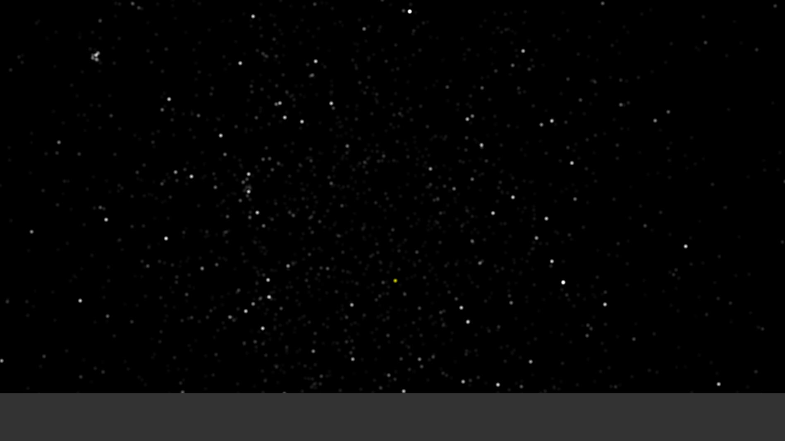

# 巡天 Night Sky Traveller
一个网页巡天应用，目标是提供市面上常用巡天软件的功能，但要更加便携、更加自定义、更加易用
希望借此应用的开发，了解更多的天文知识

**本人非专业也缺少天文知识储备，应用最终的结果也许是完全不可靠的，请谨慎使用！如有意见建议请联系**

# 功能
- 星空模拟
  - 设定观察位置
  - 模拟大气，考虑空气质量、云层和光污染
  - 模拟地景，考虑日月光和光污染

# 开发
## 1 天文数据库
### 1.1 资料
- [CDS星表库](https://gerry.lamost.org/blog/?p=417)
- [星明天文台 - 常用链接](http://xjltp.china-vo.org/cylj.html)
- [一些可用于星图制作的星表](http://luly.lamost.org/blog/star_catalogue_for_astro_amateur.html)

### 1.2 数据库平台
  - VizieR
    - VizieR是法国斯特拉斯堡数据中心开发的数据融合工具。它提供了目前已发表数据的各种查询方式：按任务、波段或源的类型查、按关键字查（作者姓名、标题等信息）、按 星表名查、日期查、图像或光谱查、首字母缩写查、最常用的星表查；对单个源按位置坐标或星名查询等。对单个星表查询，用户可以自由选择所需参数。另外它也 提供了简单的交叉证认功能，用户可以上传文件与感兴趣的星表交叉证认。 [软件工具 - 国家天文科学数据中心](https://nadc.china-vo.org/article/20200518151543)
    - [Basic tutorial VizieR](https://cds.u-strasbg.fr/tutorials/pdf/vizier-basic-tutorial.pdf)
    - 
### 1.3 数据库选择
- 准备先用BSC试试手
  - http://cdsarc.u-strasbg.fr/viz-bin/Cat?V/50
  - “它给出了全天9110颗亮于6.5等的星，肉眼可见的星都在其中。”

### 1.4 数据解析
- 格式
  - Tab-separated values (.tsv)
    - 一个通用的格式
    - 用tab分隔的字段
    - 具体有什么字段是自定义了，可以包含header
    - **计划就是用它，固定字段读取，然后生成自定义的二进制格式**
  - XEphem (.edb)
    - https://astronomy.stackexchange.com/questions/33249/star-data-format-explained
- 字段
  - 名称
    - 肉眼可见的也许有传统赋予的名称，被沿用
    - 新发现的会现有编号，随后部分可以给予单独的名称取代编号
  - 光谱类型
    - 恒星可以用光谱进行分类，共9类，色温逐渐降低
    - 光谱吸收受温度影响最大，可以反应恒星的元素组成
    - [【恒星光谱】不同恒星的谱线特征](https://zhuanlan.zhihu.com/p/132610996)
    - [Types of Stars](https://lco.global/spacebook/stars/types-stars/)

    类型|颜色
    -|-
    O|淡蓝色
    B|蓝白色
    A|白色
    F|黄白色
    G|黄色
    K|橙色
    M|红色
    
  - 赤经（Right Ascension，RA）和赤纬（Declination）
    - [Right Ascension & Declination Celestial Coordinates for Beginners](https://skyandtelescope.org/astronomy-resources/right-ascension-declination-celestial-coordinates/)
    - 类似地球经纬度的模式，用来定义天体的位置
      - **春分点**作为赤经的0°，类似经度的子午平分线
        - 但与经度不同，它只沿东方测量，范围是0°-360°，又因为一天有24小时，又可以用小时来计量，0h-24h，1h=15°，分钟秒钟也可以沿用进来
  - 自行（Proper Motion）
    - 恒星于一年内所行经的角度，赤经和赤纬各自有一个
    - 自行一般非常小
    - 形成原因
      - 本动：恒星本身的运动
      - 视察动：太阳运动引起的
    - 自行和岁差（后面坐标系会讲）加在一起称为**年变**
  - 星等（Magnitude）
    - [星等 - Wiki](https://zh.wikipedia.org/wiki/%E6%98%9F%E7%AD%89)
    - [What are Star Magnitudes?](https://www.astronomytrek.com/what-are-star-magnitudes)
    - 也叫做视星等，指代星体的相对亮度，越亮星等越低，主要由绝对星等、距离和星际尘埃决定
    - 人能分辨的极限大约是6.5等
    - 如果人们在理想环境下（清澈、晴朗且没有月亮的夜晚），肉眼能观察到的半个天空平均约3000颗星星（至6.5等计算），整个天球能被肉眼看到的星星则约有6000颗

### 1.5 知识
- 坐标系
  - 背景
    - [关于J2000.0坐标系与WGS84坐标系的理解](https://blog.csdn.net/qq_24172609/article/details/111460719)
    - 岁差
      - 地轴会绕一根轴（黄道轴）旋转，这根轴和地轴约23°26′，周期约25700年，主要原因是月球
    - 章动
      - 地轴随机摆动，大体分布再，原因是天体引力，相对岁差很小，约9.2″
      - 岁差和章动里，地轴不相对地球运动，因此不影响经纬度，但可能影响天体坐标系
    - 极移
      - 地轴相对地球本身移动，会造成经纬度变化
  - 天体坐标系（celestial coordinate）
    - https://zhuanlan.zhihu.com/p/396807910
    - 地理坐标系 Geographic Coordinate System
      - 自转轴：地球自转沿着的轴
        - 两端分别是北天极和南天极
        - 赤道：垂直于他的最大平面
        - 子午线/经线：穿过南北天极的大圆
        - 纬度（latitude）、经度（longitude）和高度（altitude）
          - 纬度：与地心连线和赤道面的夹角，北半球为正，南半球为负，范围[-90°,90°]
          - 经度：与地心连线和本初子午线的夹角，向东为正，向西为负，范围[-180°,180°]
            - 格林威治/本初子午线（Greenwich Meridian/Prime Meridian）是指经过伦敦格林威治天文台的子午线。
          - 高度：海拔高度，单位是米
        - 中天：星星穿过当地子午线的时刻（也是星星最高的时刻？），同一颗星星不同地点的中天时间不同
      - 纬度对星体可见性的影响
        - 不同纬度可见的星体是不同的，升起和落下也是不同的
        - 在赤道上，所有的星体都可见
        - 在南北极，只有一半的星体可见，且可见的都是拱极星（Circumpoalr star）
          - 拱极星
        - 其他纬度，一部分可见，有的还是拱极星，另一部分完全不可见
      - 天球地平和几何地平
        - 视地平（Apparent Horizon）：在地平面上时，视角是一个半球范围
        - 几何地平（Geometric Horizon）：站在高处时，视野范围会更大，大于一个半球
    - 地平坐标系 Horizonal Coordinate System
       - 以观测者所处的位置为中心，并且将观测者的视线作为基本面，也就是地平圈
         - 地平圈：和铅垂线垂直的平面并和天球相切，也就是我们所说的天球地平（Astronomical Horizon）
         - 
         - 对比地理坐标系，也有地平经纬线，地平子午线
         - 将星体位置投影到地平天球上，就可以用两个参数表示星体位置
           - 方位（Azimuth）：即地平经度，简称Az，；天子午圈与天体所在的地平经圈平面的夹角，从南点（S）以顺时针方向测量。方位角的取值范围为0°～360°。
            - 高度（Altitude）：即地平纬度，简称 h 或 Alt ; 天体和观测者的连线与地平圈的夹角或者天体的仰视角。高度的取值范围为+90° ~ -90°， 当高度为正数时，天体位于地平圈以上，也就是可见的天体，当高度为负数时，天体位于地平圈以下，也就无法观测。
  - J2000.0
    - J2000.0的“J”代表儒略历，从上文可以了解地球自转轴和春分点是不断变化的，如果坐标系以自转轴或者春分点做参考的话，则必须指定某一瞬时作为参考基准，这一时刻称为历元。J2000.0的历元就是2000年1月1.5日TBD（质心动力学时），对应的儒略日为2451545.0日。
      - 约50年更新一次，下一次更新在2050年
    - J2000.0坐标系以历元J2000.0的平天极及平春分点建立的协议天球坐标系，也称协议惯性坐标系，其与地球自转无关。Z轴指向北平天极，X轴指向平春分点，Y轴与Z、X成右手直角坐标系。
  - 坐标转换
    - J2000.0 → LLA → Local
    - 可能暂时不考虑很高的精度
      - 第一阶段：暂不考虑支持行星，如果整个太阳系当作一个质点误差会有多少？此时只考虑旋转角，因为距离非常远不考虑相对位置，只考虑朝向
      - 第二阶段：支持行星，对行星来说不能忽略相对位置了...
      - 除非能找到现有的库..
        - Python有，novas，甚至支持observer的功能，直接帮忙完成坐标转换...
        - https://stackoverflow.com/questions/11957633/getting-j2000-xyz-coordinates-for-a-location-on-earth-in-python
        - Astronomy支持Observer！
          - https://astronomy.stackexchange.com/questions/34129/client-side-javascript-astronomy-libraries-which-are-not-based-on-node-js
          - 但是要实现实时更新，需要在shader里自己实现
    - International Celestial Reference System, ICRS -> Horizontal coordinate
      - 

## 2 渲染
- API
  - WebGL2.0
    - 检测是否支持：http://get.webgl.org/webgl2/
    - 教程：https://webgl2fundamentals.org/webgl/lessons/zh_cn/

- 视角
  - 不宜选择常规的透视投影，因为在广角下的效果很差，和人眼差距太大
  - 鱼眼投影，可参考：[Github - shaunlebron/blinky](https://github.com/shaunlebron/blinky)
  - Stellarium似乎采用这样的策略
    - 正视天空或地面时，使用360°鱼眼投影，然后根据缩放来裁剪，这样可以观察整个天空
    - 视线水平时，使用180°鱼眼投影，也根据缩放来裁剪，似乎想保证不会同时看到两个对立的方向
    - 在中间时，fov做插值

- 星星渲染
  - 星星直径决定核心大小
  - 线性空间叠加光晕+tonemap
  - 大气影响
    - 蒙气差：大气密度产生的折射
    - 大气消光：大气物质对光线的吸收和折射
      - 空气质量
    - 大气扰动：影响视宁度，模糊、扭曲和闪烁

- 地景渲染
  - 地景建模
  - 光污染级别影响亮度、轮廓
  - 月光影响亮度

- 资料
  - [灰霾是怎么遮挡住风景的？——说说大气能见度](https://zhuanlan.zhihu.com/p/137220826)